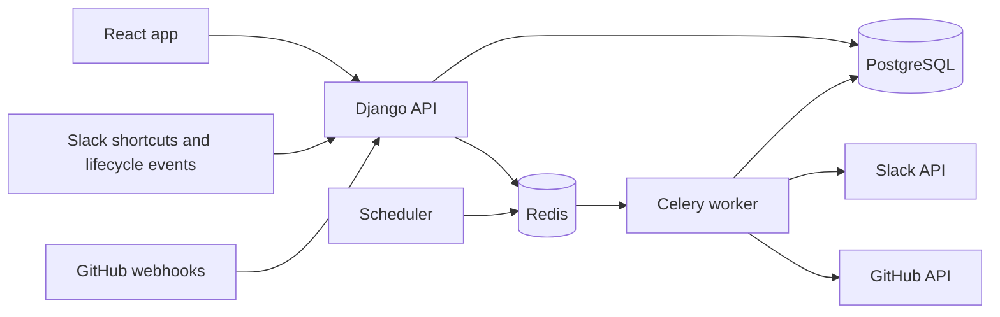

# Architecture and development conventions

## Repository layout

```text
backend/accounts/     Workspaces, memberships, invitations, sessions
backend/feedback/     Reports, problems, issues, follow-ups, and activity
backend/connections/  Slack and GitHub connections, capture, and delivery
backend/integrations/ Provider clients, signing, and payload handling
backend/operations/   Inbound receipts, durable operations, dispatch
backend/config/       Django settings, routes, ASGI/WSGI, Celery bootstrap
backend/health/       Dependency checks and worker smoke task
backend/tests/        Backend tests
frontend/src/api/     API calls and generated TypeScript contract
frontend/src/features/ Product screens grouped by feature
frontend/e2e/         Browser tests against the real local API
scripts/              Local bootstrap and service verification
openspec/specs/       Product behaviour: the current requirements
openspec/changes/     Proposed and in-progress behaviour changes
docs/adr/             Architecture decisions
```

Add a module when its workflow is implemented, not as a placeholder.

## Module responsibilities

| Module | Owns |
| --- | --- |
| Accounts | Membership, invitation, session, workspace access, and verified external identity. |
| Feedback | Reports, problems, state transitions, grouping, resolution, follow-up, and business activity. |
| Integrations/Slack | OAuth, source validation, shortcuts/modals, Slack payloads, and bot delivery. |
| Integrations/GitHub | Installation verification, credentials, issue operations, webhooks, and reconciliation. |
| Operations | Receipt deduplication, durable operation records, dispatch, recovery, and connection health. |
| Matching | Rust ranker in `rust/matcher`; Django retrieval, runs, and member decisions in `backend/matching`. See [ADR 0003](adr/0003-local-rust-matcher.md). |

- HTTP handlers and Celery tasks stay thin and call the same use cases, so permissions and state rules live in one place.
- Typed inputs and results cross module boundaries: capture produces a provider-neutral `ReportSubmission`, issue reads produce `EngineeringIssueSnapshot`, and sending takes an explicit approved notification.
- Intake, engineering, and notification are separate capabilities. Slack and GitHub do not share one connector interface.
- Shared transport, redaction, and retry classification go in small helpers. Provider business rules stay with the provider. No catch-all `utils` module.
- Use the Django ORM directly behind use cases; no generic repository layer.
- A second intake connector must feed the same report workflow without changing its rules.

## Runtime flow



Browser and API share one origin. Signed webhook routes verify their own signatures instead of a blanket CSRF exemption.

## Domain records

Ownership boundaries and required records, not one Django app per table.

| Record | Core data and constraints |
| --- | --- |
| Workspace / Membership / Invitation | Role owner/member; active membership; hashed one-use invite with expiry. |
| External identity | Workspace, provider, provider workspace and user IDs, linked membership. Unique verified mapping. |
| Connection | Workspace, provider, installation/team identity, encrypted credentials, granted scopes, status, last success/error. |
| Allowed source | Connection, Slack channel ID, validated channel type, last verification. |
| Report | Workspace, title, description, source snapshot, author, submitter, optional customer/version fields, assignee, nullable problem, triage state. |
| Problem | Workspace, summary, owner, state, resolution revision, fix note and availability evidence. |
| Engineering issue | Problem, connection, stable repository/issue IDs, number/URL, title, state/reason, update and sync times. |
| Follow-up | Report, resolution revision, recipient, contact state, outcome. Unique per report, problem, and revision. |
| Report notification operation | One prepared employee message and its delivery state. See [ADR 0004](adr/0004-report-notification-cancellation.md). |
| Activity | Workspace, actor, action, record reference, time, content-free metadata. |
| Inbound receipt / External operation | Delivery or action key, processing state, attempts, lease, remote result IDs, safe error. |

## Accounts boundary

`accounts.tokens` owns framework-free secret generation, digest checks, and expiry. `accounts.services` owns transactions and invariants. HTTP views and Celery tasks pass an explicitly resolved active `Membership` to every mutating use case; they never pass a bare user or workspace ID. Workspace permissions resolve membership on each request and hide foreign workspaces with 404. Workers must resolve and pass the actor membership too.

Use management commands for reading or writing product rows. Use `scripts/` CLIs for credential handling and provider checks that do not use the product ORM. Sessions remain in PostgreSQL. Membership is rechecked per workspace request; `session_generation` revokes all sessions after password changes or the last membership is revoked. Browser writes use CSRF tokens; `SameSite=Lax` applies to both session and CSRF cookies.

## Feedback boundary

`feedback` owns report and problem records, transitions, provenance, and activity. Mutations take a resolved active `Membership`, scope reads and references to its workspace, and check row versions under a transaction. HTTP handlers and workers should call these use cases. Activity metadata records field names and state or ID changes, not customer content.

`feedback.notifications` cancels prepared report notifications when a report is reassigned, moved, or ungrouped. It runs inside the report mutation transaction after the report row lock. See [ADR 0004](adr/0004-report-notification-cancellation.md).

`feedback.inbox` owns inbox reads. It applies the workspace filter before search and filters, so a foreign report is never counted or matched. Manual capture calls `submit_report` with no source snapshot, the same use case Slack capture uses.

## Shared contracts

DRF serializers and drf-spectacular define the API contract. `task schema` generates `frontend/openapi.yaml` and `frontend/src/api/schema.d.ts`. Frontend callers import those types and validate untrusted response values where needed. The browser uses relative `/api/` URLs; Vite proxies to Django without requiring permissive CORS settings.

Mutating browser calls send the CSRF token with session cookies.

## Runtime boundaries

- Django owns permissions, validation, transactions, and domain state.
- React owns presentation and interaction. TanStack Query owns server-state caching; React Router owns navigation.
- Celery executes background work; Redis is its broker/result backend. PostgreSQL is the source of truth for business operations.
- Provider SDKs and HTTP clients live behind integration modules. Do not put provider payloads into the core workflow API.
- Use shared application functions for operations invoked by both web requests and workers.
- Matching keeps PostgreSQL retrieval and business workflow in Django; a local Rust executable ranks only supplied candidates. See [ADR 0003](adr/0003-local-rust-matcher.md). Suggestions are not shown in the UI yet.

## Version choices

- Python 3.14, Django 5.2 LTS, Node.js 24, and Rust 1.92 (`rust/rust-toolchain.toml`, matched by the image build stage).
- Host development workers use Celery's `solo` pool. The macOS/Python 3.14 process pool failed the task round-trip check during setup; Linux container workers are verified separately with the configured process pool.
- React and Vite versions are resolved in the npm lockfile.
- TypeScript 5.9 is intentional: the selected OpenAPI type generator currently declares a TypeScript 5 peer requirement. Upgrade them together after checking compatibility.
- Ruff, mypy, Oxlint, TypeScript, and Prettier run locally and in CI.
- PostgreSQL 17 and Redis 7 images are development dependencies; the image tags track their series. Lockfiles pin application packages. A production deployment needs a separate reviewed image/update policy.

## Test boundaries

The readiness test uses real PostgreSQL and Redis. Failure tests inject dependency errors and assert that responses do not expose internals. Component tests isolate browser presentation. Playwright checks the real browser -> Vite proxy -> Django -> PostgreSQL/Redis path. The worker smoke script exercises Redis and an actual worker separately.

Provider tests use recorded, sanitised fixtures. Live provider runs are recorded separately in [LIVE_INTEGRATION_EVIDENCE.md](LIVE_INTEGRATION_EVIDENCE.md).

## Deployment

Production runs as one Compose project behind Caddy: see [DEPLOYMENT.md](DEPLOYMENT.md) and [ADR 0007](adr/0007-single-host-deployment.md). Development tunnels are in the same guide. Structured logs and trace correlation from request to outbound call are still to do; report text and secrets stay out of telemetry.
