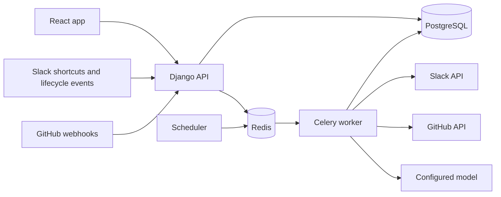

# Rescribo: MVP specification

Status: draft for review. Product direction and React + TypeScript agreed; detailed design proposed here.
Prepared: 17 September 2026.
Product name: `Rescribo`, from the Latin *rescribo*: “I write back” or “reply in writing.”

## 1. Product and outcome

Help sales, support, and account managers turn customer feedback in Slack into engineering work, then remember who needs an answer.

The app owns reports, their grouping into problems, and customer follow-up. GitHub owns engineering issues. Slack is the first capture and employee-notification channel. Customers do not need accounts in either Slack or this app.

Example: an account manager submits a Slack message about Acme's failed CSV export. A second employee submits a similar complaint from another customer. Both reports are linked to one problem and one GitHub issue. When the issue closes, a person reviews the fix, confirms availability, and approves separate employee notifications. Each employee records customer contact and the eventual outcome.

Success means completing that workflow reliably with real Slack and GitHub test accounts. A seeded demo makes the product reviewable without connecting accounts. Synthetic examples and developer testing are not evidence of customer adoption.

## 2. Scope and product rules

### Included

- Multiple isolated product workspaces; one Slack workspace and one selected GitHub repository per product workspace.
- Invite-only owner/member accounts. All members of a product workspace can read its reports and problems.
- Explicit capture of a selected Slack message, with a confirmation modal and optional customer/version/context fields.
- Manual entry as a fallback, using the same report workflow.
- Search, filter, assign, edit, group, ungroup, and dismiss reports.
- Create or link a GitHub issue, observe its status, and recover from missed updates.
- Human review of fix availability; employee notification and separate customer follow-up tracking.
- AI match suggestions with evidence and editable follow-up drafts. Manual operation remains available.
- Activity history, connection health, retry/recovery controls, seeded demo, automated tests, deployment instructions, and evaluation results.

### Deferred

- Automatic channel scraping, entire-thread import, attachments, Slack message edit/deletion synchronisation, Slack Connect, and capture from DMs/group DMs.
- Email, Teams, Discord, Zendesk, Intercom, Linear, and Jira connectors. A second intake connector is the first expansion after the Slack workflow is complete.
- Customer portal, outbound customer email, billing, CRM/customer identity resolution, automatic release detection, and code/PR analysis.
- Multiple GitHub issues per problem, cross-workspace sharing, channel-level ACL mirroring, SSO, Enterprise Grid installation, and public self-service signup.
- Autonomous issue creation, grouping, messaging, or fix confirmation.

### Invariants

1. A report describes one customer experience. A problem groups related reports. Similar names never automatically establish customer identity.
2. Message author, submitting employee, assigned member, and affected customer are separate fields.
3. GitHub issue closed, fix available, employee notified, customer contacted, and customer confirmed are distinct facts.
4. Importing an already captured source message returns the existing report. It does not silently change the report or reset follow-up.
5. Every business record, lookup, background job, suggestion, and external operation belongs to a verified workspace.
6. A model proposes; application code validates; a person approves business changes and outbound content.

## 3. Integration options checked

These findings come from current official documentation, not a live installation test. The implementation starts with the smoke checks in section 12.

| Option | Finding | Decision |
| --- | --- | --- |
| Slack message shortcut | Preserves selected-message context and can open a modal; requires `commands`. Interactions must be acknowledged within three seconds. [S1, S2] | Use **Submit customer feedback** on a message. |
| Slash command/global shortcut | Does not inherently supply the selected message. [S1] | Manual entry in the web app covers that need initially. |
| Slack Events API intake | Would introduce continuous collection and filtering. | Do not subscribe to message streams. Use lifecycle events only. |
| Slack thread retrieval | Requires history permissions and has distribution-dependent rate limits. [S3] | Capture one message snapshot plus context the submitter supplies. |
| Temporary Slack response URL | Limited to five responses within 30 minutes. [S4] | Use only for immediate acknowledgement where applicable, never delayed follow-up. |
| Bot DM | `conversations.open` opens a DM; `chat.postMessage` sends to its conversation ID. [S5, S6] | Send approved follow-ups directly to the submitting employee. |
| GitHub App | Supports selected repositories and separate issue permissions. [G1] | Use installation credentials, not a personal access token. |
| GitHub issue API | Installation tokens can create issues with Issues write permission and read issues with Issues read permission. [G2] | Request Issues read/write and required Metadata read only. |
| GitHub webhooks | Signed deliveries, delivery IDs, prompt acknowledgement, and missed-delivery recovery are documented. [G3] | Persist accepted events, process asynchronously, reconcile linked issues. |

Slack distribution is a separate launch concern. Develop in a test workspace, then use the documented unlisted distribution route for a limited pilot. Do not assume commercial distribution avoids Marketplace review. [S10]

## 4. Slack capture and follow-up

### Installation and allowed channels

- An authenticated product owner starts Slack OAuth. Bind a single-use state to that owner, workspace, browser session, and a ten-minute expiry. [S11]
- Verify returned app/workspace identity and granted scopes. Prevent a Slack workspace from being attached to two product workspaces.
- The owner supplies approved channel IDs/links. Use `conversations.info` to verify that each is an internal public or private channel, is active, and includes the bot. [S7]
- Request bot scopes: `commands`, `channels:read`, `groups:read`, `chat:write`, and `im:write`. No message history, file, email-address, or user-token scopes.
- Private-channel capture is an explicit publication into the product workspace. Setup and the submission modal state: **This report will be visible to all members of [workspace].** Do not claim that Slack channel permissions are preserved.
- Do not enable a channel if that sharing model is unsuitable. Reject DM, externally shared, archived, unknown, and unapproved sources. A changed channel configuration must be revalidated before accepting capture.
- Installation success is separate from readiness: show missing scopes, absent bot membership, and unavailable channels as setup problems.
- Subscribe to app-removal lifecycle events and handle URL verification. On verified removal, disable the connection and cancel pending sends. Also detect revocation through API errors; receiving the removal event is not the only recovery path. [S12]

### Identity and submission

1. A signed shortcut identifies the Slack team, actor, channel, and selected message. Verify the raw-body signature and timestamp before trusting it. [S2, S8]
2. The actor must be linked to an active product membership. First-time linking uses a short-lived, single-use code generated in the logged-in web account and entered into a Slack modal. Bind redemption to the signed Slack actor and installed team; do not match by display name or email.
3. Acknowledge immediately and open the modal using the short-lived trigger. Do not run AI, fetch history, or wait for GitHub in this path.
4. Show a preview and editable report title, optional customer organisation/contact reference, affected version, and additional context. The selected-message snapshot remains separate from edited report text.
5. On submit, validate membership, source approval, and fields. A successful modal submission means the report and its activity entry are committed. A database failure returns a visible error, not a success acknowledgement.
6. Persist short-lived capture context server-side and put only its opaque ID in modal metadata. Expired context requires starting the shortcut again. Never let modal metadata choose an arbitrary workspace or source message.
7. Resolve the message permalink asynchronously using `chat.getPermalink`; display a retryable link error if needed. The report survives permalink failure. [S9]
8. Return the report link. Deduplicate with a database constraint on workspace, provider team, channel, and message timestamp. Different messages in the same thread remain separate reports until someone groups them.

Source channel revalidation must not break Slack's acknowledgement deadline. Validate channel setup ahead of use; use a short-lived cache for the initial modal, then perform revalidation while the modal is open. Fail closed on submission if validation has not succeeded or the channel is no longer eligible. Do not retain text from rejected sources.

The snapshot includes only the selected message's text and source identifiers. A reply may be captured without the parent conversation; say this in the preview. Do not fetch attachments, linked pages, or the rest of the thread. Label the stored content **Captured on [date]**, not a live copy.

### Employee notification

- After fix confirmation, create one follow-up per active linked report for that resolution revision.
- A member reviews and edits the exact message and destination before sending. Default destination is the submitting employee's bot DM, not the original channel.
- Open/resume the DM with `im:write`, then send with `chat:write`. Store returned conversation/message IDs. [S5, S6]
- The message identifies the report, approved fix note, and source link. Do not include other customers' reports or internal issue content by default.
- Only the intended linked member may use a signed Slack action to record **Customer contacted** or **Customer confirmed**. Recheck membership on every action. The same actions are available in the web app.
- Failed delivery stays visible and never changes the customer-contact status. If the employee has left, an owner reassigns the report to an active linked member before sending.
- Manual reports use their assigned linked member as the employee recipient. If no verified Slack recipient exists, offer copy-to-clipboard and manual follow-up recording; never guess a Slack identity.
- Customer replies still arrive outside this app. Employees record the result; a bot DM is never treated as proof of customer contact.

## 5. GitHub integration

- The owner installs the GitHub App and selects one repository. Request Issues read/write and Metadata read; no Contents, Pull requests, or Administration permission. [G1, G2]
- Bind the installation flow to a single-use state and the product workspace. Verify the connecting GitHub user's access to the installation through GitHub's user authorisation flow before binding it. Never trust `installation_id` from a callback alone. [G4]
- Discard setup user credentials when verification is complete. Use short-lived installation tokens, restricted to the selected repository, for ongoing requests. GitHub documents a one-hour token expiry. [G5]
- Show the selected repository and its visibility. The owner explicitly permits workspace members to see the linked issue metadata and create issues through the app.
- **Link existing:** accept a GitHub issue URL/number, verify it belongs to the configured repository, fetch it, and reject pull requests. GitHub issue endpoints may also return PRs. [G2]
- **Create:** preview an editable title/body and destination. Default body contains the problem summary and a product link, without customer identities or raw Slack excerpts. Publish only on an explicit user action.
- One active GitHub issue link per problem; one issue maps to one problem within a product workspace. Relinking records history and clears any pending approval based on the old issue.
- Subscribe to Issues and installation/access lifecycle events. GitHub Apps receive `installation` and `installation_repositories` events automatically; only Issues needs an explicit subscription. Handle close, reopen, edits, deletion/transfer, repository removal, and suspended/deleted installations. GitHub will not remove a repository that is the last one selected, so effective revocation may arrive as an installation deletion; treat repository removal and installation deletion as the same access-lost signal (both were observed returning HTTP 404). [G6]
- A verified close event flags **Review engineering update**. Preserve `state_reason`; a closure as not planned is not a fix. Human confirmation requires a fix note and availability/version information, with optional evidence URL.
- Fetch current issue state when processing a change, serialize processing per issue, and retain provider update times. An old webhook must not overwrite newer state.
- Reconcile active linked issues every 15 minutes and expose **Refresh status**. Show last successful sync and stale/access-lost status. An inaccessible issue is unknown, not closed.
- Reopened issues invalidate unsent fix notifications and flag the problem for review. Already sent notifications and recorded customer outcomes remain in history.

## 6. Screens and user journeys

| Screen | Required behaviour |
| --- | --- |
| Sign-in and invite acceptance | Login/logout, one-use invitation, password setup, clear expired-invite handling. |
| Inbox | Paginated reports; search text/customer reference; filter new/linked/dismissed, assignee, and source; report detail panel; manual capture; match suggestions; group/ungroup/dismiss. |
| Problems | Searchable list with report count, owner, internal status, external issue status, and attention indicators. |
| Problem detail | Editable summary, linked reports with provenance, GitHub link/create flow, fix review, activity history, and report reassignment. |
| Follow-ups | Needs approval, delivery failed/uncertain, awaiting customer contact, awaiting confirmation, and completed; exact-message preview and individual actions. |
| Settings | Membership/invites, Slack account linking, connections and channels, GitHub repository, AI enablement, disconnect, and deletion controls. |

Use a desktop-first responsive layout that remains usable on mobile. Forms need labels, keyboard operation, visible focus, and inline errors. Every asynchronous screen has loading, empty, error, and retry states. Preserve unsaved drafts on recoverable failures. Refresh background state with bounded polling; websockets are not required.

## 7. Domain model and transitions

These are ownership boundaries and required records, not a requirement for one Django app or service per table.

| Record | Core data and constraints |
| --- | --- |
| Workspace / Membership / Invitation | Role owner/member; active membership; hashed one-use invite with expiry. At least one active owner must remain. |
| External identity | Workspace, provider, provider workspace ID, provider user ID, linked membership. Unique verified mapping. |
| Connection | Workspace, provider, external installation/team identity, encrypted credentials where needed, granted scopes, status, last success/error. |
| Allowed source | Connection, Slack channel ID, validated channel type, last verification. |
| Report | Workspace, title, description, source snapshot/reference, author, submitter, optional customer label/contact reference/version, assignee, nullable problem, triage state. |
| Problem | Workspace, title/summary, owner, state, resolution revision, fix note and availability evidence. |
| Engineering issue | Problem, connection, stable repository/issue IDs, number/URL, title, state/reason, external update and sync timestamps. |
| Follow-up | Report, resolution revision, intended employee, draft/version, employee-delivery state, customer-contact state, outcome and timestamps. Unique report + resolution revision. |
| Activity | Workspace, actor/system identity, action, record reference, time, minimal change metadata. |
| Inbound receipt / External operation | Provider delivery or action key, workspace/connection, processing state, attempts, next attempt, remote result IDs, safe error. |
| AI suggestion/run | Workspace, input record versions, candidate IDs, evidence, model/prompt version, outcome, timing, token usage where available, user decision. |

Enforce source uniqueness in PostgreSQL. Scope every foreign-key assignment to the workspace, including background tasks. Apply workspace filters before search, aggregation, or candidate selection. Never rely on UUID secrecy as authorisation.

### State rules

- Report triage: `new -> linked` or `dismissed`. Unlink returns to `new`; restore reverses dismissal. A dismissed report does not generate follow-ups.
- Problem: `open -> in_progress -> fix_available`, with `not_planned` as an explicit alternative. Members may move between open/in-progress or return a not-planned problem to open. Fix availability requires human confirmation and increments the resolution revision; it may also be confirmed directly from open.
- GitHub state is displayed independently. Closure sets a review flag, not `fix_available`. A decision not to fix requires a reason and does not generate a fix notification.
- Employee delivery: `draft -> queued -> sent`, or `failed` / `uncertain`. Approval is tied to the draft and resolution versions; editing or reopening invalidates an unsent approval.
- Customer contact: `pending -> contacted -> confirmed`, or `still_affected` / `no_response`. `no_response` requires a dated note and does not count as resolved. `still_affected` flags the problem for review without reopening GitHub automatically.
- A newly linked report on a fixed problem gets its own follow-up after a member verifies that the existing fix applies. Ungrouping/reassignment cancels unsent operations and requires a new preview; sent history remains.
- Use row versions for conflicting edits. Return a conflict with current data rather than silently overwriting another member's decision.
- Reopening the linked issue puts a fixed problem back into `in_progress` with a review flag. A person can later reconfirm availability as a new revision. Previously sent follow-ups remain historical records; they do not suppress follow-ups for the new revision.
- In the web app, customer-contact outcomes may be recorded by the assigned member, original submitting member, or an owner. Record who made the statement and when. Owners can correct an outcome with a reason; notification delivery remains a separate system-recorded fact.

## 8. Architecture and maintainability

### Proposed stack

- **Frontend:** React + TypeScript, Vite, React Router, TanStack Query. Feature modules for inbox, problems, follow-ups, and settings; shared accessible UI components and API types. Vite supplies a React/TypeScript template; TanStack Query manages asynchronous server state. [T1, T2]
- **Backend:** Django + Django REST Framework. Use Django's auth, sessions, ORM, and migrations; DRF for validated REST endpoints. One Python application, deployed as web and worker processes. [T3, T4]
- **Storage:** PostgreSQL for business state, search, receipts, operations, and audit history.
- **Background execution:** Celery with Redis, plus one Celery Beat scheduler. Use established task/retry machinery rather than creating a queue framework. Business operation state remains in PostgreSQL. [T5]
- **Integrations:** Slack's Python SDK for API calls/signature helpers; a dedicated GitHub HTTP client. Provider-specific auth, payload validation, and error translation stay in their modules.
- **AI:** one configured provider/model initially, behind typed decision and generation boundaries. Start with bounded calls; LangGraph is not required by the agreed workflow. Operator-supplied credentials or a compatible local endpoint; AI can be disabled.
- **Tooling:** uv and npm lockfiles; Python/TypeScript formatting and static checks; pytest, frontend component tests, and Playwright journey tests. Pin compatible supported versions during implementation.

Django is proposed over FastAPI because this product has substantial account, permission, data-editing, and migration work. React remains responsible for the product interface. A separate Node backend is unnecessary for this design.

### Module responsibilities

| Module | Owns |
| --- | --- |
| Accounts | Membership, invitation, session, workspace access, and verified external identity. |
| Feedback | Reports, problems, state transitions, grouping, resolution, follow-up, and business activity. |
| Integrations/Slack | OAuth, source validation, shortcuts/modals, Slack payloads, and bot delivery. |
| Integrations/GitHub | Installation verification, credentials, issue operations, webhooks, and reconciliation. |
| AI | Candidate ranking, structured suggestions/drafts, evidence validation, and evaluation. |
| Operations | Receipt deduplication, durable operation records, dispatch, recovery, and connection health. |

- Keep HTTP handlers and Celery tasks thin. Both call the same application use cases so permissions and state rules are not duplicated.
- Use typed inputs/results at module boundaries. Capture produces a provider-neutral `ReportSubmission`; issue reads produce `EngineeringIssueSnapshot`; sending accepts an explicit approved notification and returns a delivery result.
- Separate intake, engineering, and notification capabilities. Do not require GitHub and Slack to implement one large connector interface.
- Put shared transport concerns, redaction, and retry classification in small reusable helpers. Keep provider business rules with the provider.
- Use Django's ORM directly behind these use cases; a generic repository layer is not required. Avoid a shared `utils` module that becomes the home for unrelated business rules.
- Generate frontend API types from the backend OpenAPI schema. Keep runtime validation at external boundaries; TypeScript types do not validate network input.
- Test connector contracts independently and reuse shared workflow tests with recorded, sanitised provider fixtures. A second intake connector should feed the same report workflow without modifying its rules.
- Document important decisions in short ADRs. Optimise for readable boundaries and maintenance, not minimum file or dependency counts.

### Runtime flow

Serve browser and API under one origin. Use secure HttpOnly session cookies and CSRF protection on browser writes, including login. OAuth callbacks use state validation; signed webhook routes have their own verification, not a blanket CSRF exemption. [T3, T4]

## 9. Reliability and data handling

- Commit a report/state change and its pending external operation in one database transaction. Dispatch after commit. A periodic dispatcher recovers operations not published to Redis; `on_commit` alone does not solve a failed broker publish. [T5]
- Verify signatures before storing inbound events. Persist accepted GitHub receipts before responding; aim below one second and stay below its documented ten-second response limit. [G3]
- Use GitHub delivery IDs, Slack event IDs for lifecycle events, and deterministic action/source keys for shortcuts. These are different payload types, not interchangeable event formats.
- Workers claim operations atomically with expiring leases. Recheck workspace, connection, membership where applicable, and approved input version before external writes.
- Reads retry with capped exponential backoff and jitter. Respect provider `Retry-After`. Invalid/revoked credentials pause dependent work and show reconnection guidance; they must not cause an endless retry loop.
- A non-idempotent write may succeed remotely before a timeout or worker crash. Do not claim exactly-once delivery. Mark the result `uncertain` and reconcile before retrying.
- For issue creation, include an opaque operation marker in the approved issue body and search/list the selected repository to recover a matching issue before retry. Honour pagination and rate limits. If no conclusive result is available, require manual reconciliation.
- For Slack sends without a conclusive response, show the target and approved message for a member to check. Do not automatically resend an ambiguous write. A confirmed resend warns about possible duplication and records the decision.
- Connection settings show queued, failed, and uncertain operations; last successful API request; last successful issue reconciliation; and actionable errors. Silence from a webhook alone is not a health failure.
- Revalidate access at use time. Disconnect deletes usable credentials and stops pending sends; it does not silently erase stored reports. Reconnection does not automatically release obsolete approvals.
- Store secrets encrypted with a maintained cryptography library and an operator-managed key outside the database. Never log tokens, response URLs, invite codes, raw message bodies, or customer content.
- Temporary capture contexts expire after 15 minutes. Successful raw webhook payloads, if needed for processing, are purged within seven days; retain only minimal deduplication/status metadata afterwards. Keep business records until owner deletion; document backup expiry separately.
- Owners can delete reports and their snapshots/AI artefacts; retain only content-free deletion metadata. Workspace deletion revokes/stops integrations and removes tenant data. Do not automatically delete upstream messages or issues.

## 10. AI behaviour and evaluation

### Matching

1. Retrieve candidates from the same workspace using PostgreSQL text search over problem titles, summaries, and linked report descriptions.
2. Send a bounded candidate set and the new report to the configured model, omitting customer contact details unless essential and explicitly enabled.
3. Return up to three suggested problem IDs, a short explanation, and evidence references, or abstain.
4. Validate IDs and evidence against the supplied candidate set. Invalid output becomes an unavailable suggestion, not a business mutation.
5. Record accept/reject decisions. Never label a model's self-reported number as a calibrated probability.

This first retrieval method may miss paraphrases. Measure candidate recall before attributing a missed match to the model. Add semantic retrieval only if the evaluation demonstrates the need; keep it behind the candidate retrieval boundary.

### Initial Jev matching design

- Use OpenRouter with one operator-managed `OPENROUTER_API_KEY`. Workspace owners enable AI per workspace; users do not supply keys. Missing credentials make AI unavailable without failing application health checks.
- Pin `typesafe/jev-1.13`. Model upgrades are explicit and require a new evaluation run. [J1]
- Run matching asynchronously after report creation or a relevant edit. Store the report version with the run, check it before the provider call and before saving, and discard stale results. Provider failure never rolls back report capture.
- Retrieve the top ten candidates from the same workspace with PostgreSQL text search. Include problem titles, summaries, and bounded linked-report excerpts. Exclude customer contact details and provider identifiers.
- Send one bounded Decisions request containing:
  - one Choice across the candidate problem IDs plus `no_match`;
  - one Noul per candidate asking whether it represents the same underlying problem; and
  - one Choice per candidate selecting the strongest supplied evidence reference or `no_evidence`. [J2]
- Rank with the relative Choice distribution and gate with each candidate's independent Noul result. Do not assume those judgments must agree. Derive thresholds from the development dataset, then freeze them before held-out evaluation.
- Build the explanation in code from validated IDs and the selected source reference. Jev does not generate explanation text. Reject unknown candidate or evidence IDs.
- Return at most three suggestions. A person accepts or rejects them; Jev cannot link, dismiss, or otherwise mutate a report or problem.
- Keep provider-specific transport in `integrations/openrouter`. The AI module owns retrieval, questions, result validation, thresholds, persistence, and evaluation. Use the existing `httpx` dependency for the OpenRouter Decisions endpoint rather than adding the TypeSafe SDK, which uses TypeSafe's API and credentials.
- Send `provider.zdr: true` and `provider.data_collection: "deny"`. Never log credentials, request bodies, response bodies, report text, or evidence text. [J3]
- Record an AI matching run with workspace/report IDs, report version, model and question-set versions, supplied candidate/evidence IDs, typed answers, usage, latency, status, and a safe error. Do not duplicate report text in the run record.
- Store each suggestion as a workspace-scoped relation to its run and problem, with rank, Choice probability, Noul probability, evidence reference, and pending/accepted/rejected outcome. Database constraints and application checks prevent cross-workspace or duplicate suggestions.
- Expose only the latest non-stale run through the report API. Use separate authenticated actions for retry, accept, and reject. Acceptance calls the normal report-linking use case; the AI module does not own that transition.

The OpenRouter Decisions API is currently alpha. Contain request and response changes in the adapter, validate responses at that boundary, keep sanitised contract fixtures, and use capped retries for retryable provider failures. [J4]

Because the repository is still an environment scaffold, record this design now but do not build persistence, tasks, or UI ahead of the report/problem/workspace foundations. The first implementation is an opt-in live contract check using synthetic data and the operator's OpenRouter key. It verifies the pinned model, Choice, Noul, evidence selection, privacy fields, response validation, and failure handling. Full product integration remains milestone D after the manual workflow and isolation foundations exist.

### Drafting

- Jev is not used for drafting. The initial product uses the deterministic follow-up template. A separate generative model and evaluation are later work if deterministic drafting proves insufficient.
- Use only the report and human-approved resolution details. Do not invent release dates, versions, causes, or customer promises.
- Treat report/issue text as untrusted data. No model tools, external page fetches, or authority to write to integrations.
- Display editable output with the resolution it was based on. Changed inputs invalidate the draft approval.
- Default AI off until an owner enables it and sees which configured provider receives the selected text. Manual search/grouping and a deterministic follow-up template remain available.
- Bound input/output size, concurrency, timeout, and daily per-workspace calls. Record model/prompt versions, latency, and usage where the provider reports it.

### Evaluation deliverable

- Version a labelled synthetic dataset with genuine matches, no-match reports, similar symptoms with different causes, missing context, misleading version details, and prompt-injection text.
- Separate development and held-out cases. Derive case counts from fixtures, not hard-coded expectations.
- Report candidate recall@k, top-suggestion precision, suggestion coverage, abstention behaviour, and evidence validity. Compare against text-search-only ranking.
- For Jev matching, also report top-three recall and evidence-selection accuracy. Tune thresholds on the development set only, then freeze them for the held-out run.
- Evaluate drafts for unsupported claims and omission of required fix details. Manually inspect a documented sample.
- Proposed release bar: at least 90% top-suggestion precision on a held-out set containing at least 30 non-abstained suggestions, 100% valid record references, and no unsupported claims in the reviewed draft set. Report sample sizes and coverage; high precision from near-total abstention is not success.
- If matching does not beat the baseline meaningfully, ship manual/search matching and label AI experimental. Do not hide the result or claim validated AI quality.

## 11. Accounts, deployment, and demo

- Bootstrap the first owner with an interactive management command. No default public credentials or self-service signup.
- Owners create hashed, one-use invitations expiring after 48 hours and share the links themselves. Invite acceptance sets a password using Django's validation/hashing. App login is separate from Slack installation.
- Rate-limit login and token redemption. Logout and membership revocation invalidate access. Password recovery is an owner-issued one-use reset link for members; the operator has a documented recovery command for the owner. No email provider is required for the pilot.
- Package web, worker, scheduler, PostgreSQL, and Redis in Docker Compose. Terminate HTTPS at the deployment proxy. External callbacks require a stable HTTPS URL; document a development tunnel and its secret-handling implications.
- Include migrations, health/readiness checks, structured logs, backup/restore instructions, and a restore smoke test. Add trace correlation from request/event through operation and outbound API attempt; exclude report text and secrets from telemetry.
- Start with a container deployment on infrastructure the developer controls. A managed-cloud deployment is a later learning milestone, not a prerequisite for the functional MVP.
- Seed a separate demo workspace with fictitious companies, reports, issues, mistakes, and failures. Display a demo label. Demo mutations must never call real integrations or a paid model by default.
- Public demonstration uses isolated demo data and disabled integration setup/outbound capabilities. Do not expose the private test workspace or credentials.

## 12. Delivery sequence and acceptance criteria

These are build milestones, not estimates or a task-by-task implementation plan.

### A. Live integration feasibility

- Register test apps and use a disposable Slack workspace and GitHub repository.
- Verify shortcut -> modal -> submission for a root message and a thread reply, in approved public and private channels, using exactly the proposed scopes.
- Verify account linking, channel revalidation, permalink retrieval, and a bot DM sent more than 30 minutes after capture.
- Verify GitHub installation ownership checks, selected-repository issue creation/read, signed closure/reopen events, and access revocation.
- Record tested app settings, granted scopes, observed payloads after sanitisation, and any platform limitations. Update this spec if observed behaviour differs from documentation.
- Consolidated sanitised evidence lives in [`LIVE_INTEGRATION_EVIDENCE.md`](LIVE_INTEGRATION_EVIDENCE.md), separate from mocked tests. Slack capture, identity boundaries, and both GitHub checks have live runs; the delayed bot DM (issue #26) is planned but not yet exercised live.

### B. Product without AI

- A real owner can invite a member who signs up in a separate browser session.
- Capture a Slack report; manually create a second report; group both into a problem; ungroup/reassign without losing provenance.
- Link/create an issue with a preview; close it on GitHub; confirm a fix; preview/send an employee update; record customer contact and confirmation independently.
- Verify all screens' loading, empty, error, keyboard, and narrow-screen states.

### C. Failure and isolation coverage

- Duplicate shortcut submissions and webhook deliveries do not duplicate reports, transitions, or queued operations.
- Bad signatures, stale Slack requests, expired OAuth state, forged installation IDs, and unlinked/revoked members cannot mutate data.
- A second workspace cannot read, link, search, count, suggest against, or send using another workspace's records or credentials.
- Private/unapproved/external channels follow the stated policy. Publication consent is visible; rejected message text is not retained.
- Simulate broker outage after database commit, worker crash before/after a remote write, provider 429/5xx, revoked credentials, and inaccessible/deleted issues. Assert recoverable or uncertain state rather than lost work or blind resend.
- Close/reopen webhooks delivered in reverse order produce current GitHub state. Reopening invalidates an unsent notification approval.
- Concurrent edits, stale drafts, report reassignment, and a late report linked to an already fixed problem obey section 7.
- Verify deletion and retention jobs remove content from primary storage and document backup retention.

### D. AI and portfolio delivery

- Before the product AI work, run the synthetic live Jev/OpenRouter contract check described in section 10. Keep it opt-in and separate from the normal test suite.
- Run the held-out evaluation and publish the actual results with model/prompt configuration and limitations.
- Verify invalid IDs, injected instructions, provider timeout, disabled AI, and exhausted budget leave manual work functional.
- Demonstrate the complete live Slack/GitHub journey. Keep live evidence separate from mocked integration tests and synthetic evaluation.
- Deliver a seeded demo, short walkthrough, architecture/decision notes, setup and recovery runbook, and CI checks.
- Document measured timings and test conditions rather than claiming production scale or real user adoption.

### Definition of MVP complete

The live workflow in milestone B works; milestone C passes; AI meets its stated bar or is explicitly experimental/disabled; the demo and setup instructions are reproducible. A second intake connector is not required to call this first workflow complete, but broad integration support must not be claimed until additional connectors exist.

## 13. Review decisions

- Confirmed: internal team inbox; Slack first; GitHub engineering tracking; Python backend; React + TypeScript frontend.
- Proposed in this spec: Django/DRF, Celery/Redis, direct employee DMs, selected public/private channels with explicit publication, and invite-only app accounts.
- Confirmed: the product is named Rescribo and the initial matching model is pinned to `typesafe/jev-1.13` through OpenRouter. Hosting provider selection remains an implementation decision.
- Reusability, modularity, DRY, and maintainability are primary code-quality requirements.

## Sources

Checked 20 September 2026. API support is documentation-verified; live feasibility remains milestone A.

- [S1: Slack shortcuts](https://docs.slack.dev/interactivity/implementing-shortcuts/)
- [S2: Shortcut payloads](https://docs.slack.dev/reference/interaction-payloads/shortcuts-interaction-payload/)
- [S3: Slack thread retrieval](https://docs.slack.dev/reference/methods/conversations.replies/)
- [S4: Handling interactions and temporary responses](https://docs.slack.dev/interactivity/handling-user-interaction/)
- [S5: Opening Slack DMs](https://docs.slack.dev/reference/methods/conversations.open/)
- [S6: Sending Slack messages](https://docs.slack.dev/reference/methods/chat.postMessage/)
- [S7: Conversation information](https://docs.slack.dev/reference/methods/conversations.info/)
- [S8: Verifying Slack signatures](https://docs.slack.dev/authentication/verifying-requests-from-slack/)
- [S9: Slack permalinks](https://docs.slack.dev/reference/methods/chat.getPermalink/)
- [S10: Slack distribution](https://docs.slack.dev/app-management/distribution/)
- [S11: Slack OAuth installation](https://docs.slack.dev/authentication/installing-with-oauth/)
- [S12: Slack app removal event](https://docs.slack.dev/reference/events/app_uninstalled/)
- [G1: GitHub App permission selection](https://docs.github.com/en/apps/creating-github-apps/registering-a-github-app/choosing-permissions-for-a-github-app)
- [G2: GitHub issues API](https://docs.github.com/en/rest/issues/issues)
- [G3: GitHub webhook best practices](https://docs.github.com/en/webhooks/using-webhooks/best-practices-for-using-webhooks)
- [G4: GitHub App user authorisation](https://docs.github.com/en/apps/creating-github-apps/authenticating-with-a-github-app/authenticating-with-a-github-app-on-behalf-of-a-user)
- [G5: GitHub installation authentication](https://docs.github.com/en/apps/creating-github-apps/authenticating-with-a-github-app/authenticating-as-a-github-app-installation)
- [G6: GitHub webhook events](https://docs.github.com/en/webhooks/webhook-events-and-payloads)
- [T1: Vite templates](https://vite.dev/guide/)
- [T2: TanStack Query](https://tanstack.com/query/latest/docs/framework/react/overview)
- [T3: Django authentication](https://docs.djangoproject.com/en/5.2/topics/auth/default/)
- [T4: DRF authentication](https://www.django-rest-framework.org/api-guide/authentication/)
- [T5: Celery and Django](https://docs.celeryq.dev/en/stable/django/first-steps-with-django.html)
- [J1: Jev 1.13 on OpenRouter](https://openrouter.ai/typesafe/jev-1.13/)
- [J2: TypeSafe primitives](https://docs.typesafe.ai/primitives)
- [J3: OpenRouter privacy controls](https://openrouter.ai/docs/guides/get-started/sovereign-ai)
- [J4: OpenRouter Decisions API integration](https://github.com/OpenRouterTeam/ai-sdk-provider)
